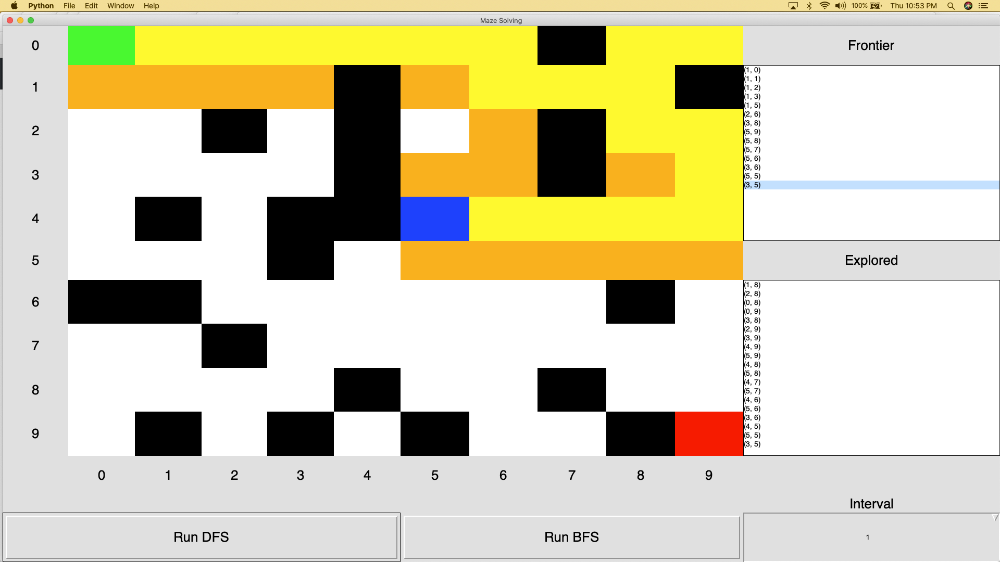

# MazeSolvingGUI
A simple tkinter GUI for illustrating depth-first search (DFS) and breadth-first search (BFS). For a well explained version of these algorithms checkout chapter 2 of [Classic Computer Science Problems in Python](https://github.com/davecom/ClassicComputerScienceProblemsInPython).

## Running

Requires Python 3.7+
No external dependencies beyond the Python standard library with tkinter.

```
python3 maze_gui.py
```

Note that each time you run a new random maze is generated. You can change the time interval using the drop down on the bottom right. The green square is the start location, red square is the goal, blue square is the current cell being explored, white squares are empty, black squares are blocked, yellow is the cells that have been popped off the frontier, orange cells are still on the frontier, and cyan cells represent the final found path.



## License
Released under the Apache License version 2.0. See `LICENSE`.
